  
  
   
  
  

    
    
    
  

  
  

## 👨‍💻 Обо мне

Я **16-летний разработчик** из России, учусь в 9 классе и увлекаюсь созданием full-stack приложений, а также изучением DevOps практик.

- 🔭 **Сейчас разрабатываю:** [SafeWire](https://github.com/AlmazIsDev/SafeWire) — защищенный мессенджер с кроссплатформенной поддержкой (приватный репозиторий)
- 🚀 **Прошлые проекты:** WeissX Hosting, [MXL Hosting](https://mx-labs.net) + Discord боты для сообщества, Сайт для Tech-Developers
- 🤖 **Бот:** [MAX-TG](https://github.com/AlmazIsDev/MAXToTelegramBot) — пересылает сообщения между мессенджером MAX и Telegram (приватный репозиторий)
- 💡 **Интересы:** Системная архитектура, облачные технологии, создание масштабируемых приложений
- 🎯 **Цель:** Ищу возможности для фриланса или удаленной работы на частичную занятость

 

## 🛠 Мой стек

### Языки программирования

### Фреймворки и библиотеки

### DevOps и инструменты

## 🥇 Один из моих Проектов/Сайтов

  

## 📊 GitHub статистика

  <table>
    <tr>
      <td align="center">
        
      </td>
    </tr>
    <tr>
      <td align="center">
        
      </td>
    </tr>
    <tr>
      <td align="center">
        
      </td>
    </tr>
  </table>

## 🚧 Избранные проекты

| Проект | Описание | Стек | Статус |
|:------:|:---------|:-----|:------:|
| **SafeWire** | Полноценный мессенджер со сквозным шифрованием | React, Python, React Native, Java | 🚧 В разработке |
| **MXL Hosting** | Хостинг игровых серверов/сайтов/ботов с автоматическим деплоем | Pterodactyl | ✅ Активен |
| **WeissX Hosting** | Хостинг сайтов и ботов | Pterodactyl, CtrlPanel | 📦 В архиве |
| **MAX-TG Bridge** | Автоматический бот для пересылки сообщений | Python, Telegram API | 🤖 Работает |

## 🌐 Связаться со мной

  

  
  
  
  
   
  
  <i>⚡️ "Код как юмор. Когда его приходится объяснять — он плохой." ⚡️</i>
  
   
   
  
  

